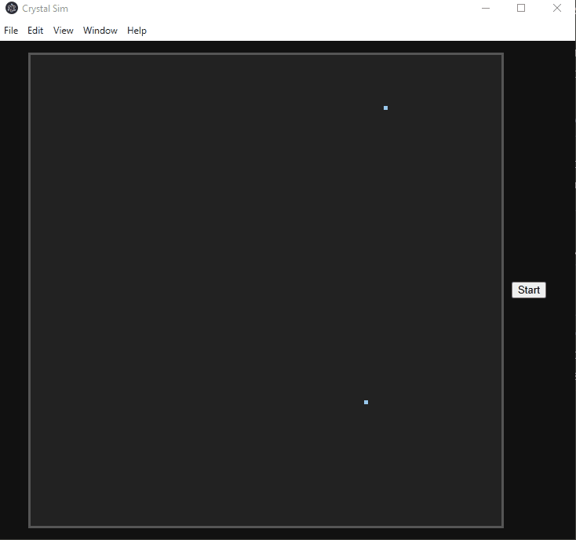

# Crystal Growth Simulation 🧊✨

This project is a **Diffusion-Limited Aggregation (DLA)** simulation built in **JavaScript + HTML Canvas**.  
It simulates how particles (atoms) randomly move and stick together to form crystal-like structures.  

## 🎥 Demo  

  
*(The simulation of atoms walking and forming a crystal)*  

---

## 🚀 Features
- Random particle motion (Brownian motion style).
- Atoms attach to nearby crystal structure.
- Multiple seeds supported.
- Interactive start button to trigger growth.
- Canvas-based visualization.

---

## 🖥️ How It Works
1. A **seed particle** is placed on the grid.  
2. New **atoms spawn randomly on the grid edges**.  
3. Atoms move randomly in 2D until they touch the crystal.  
4. Once touching, they **stick and become part of the crystal**.  
5. Repeat → the cluster grows into a branching structure.

---

## 🛠️ Technologies
- **HTML Canvas** – for rendering.
- **JavaScript** – simulation logic.
- **CSS** – basic styling.

---

## ▶️ Installation
- Clone the repo:

    ```bash
    git clone https://github.com/Serwindev/crystal-sim.git
    cd crystal-sim
- Install dependencies:
    ```bash
    npm install
- Start the app:
    ```bash
    npm start
---
## 🤝 Contributions
Contributions are welcome!
If you’d like to improve the simulation or add features, feel free to fork this repo and open a pull request.

---

## 📜 License
This project is licensed under the MIT License.

---

## 👨‍💻 Developer
Dev-ed with ❤️ by Serwin